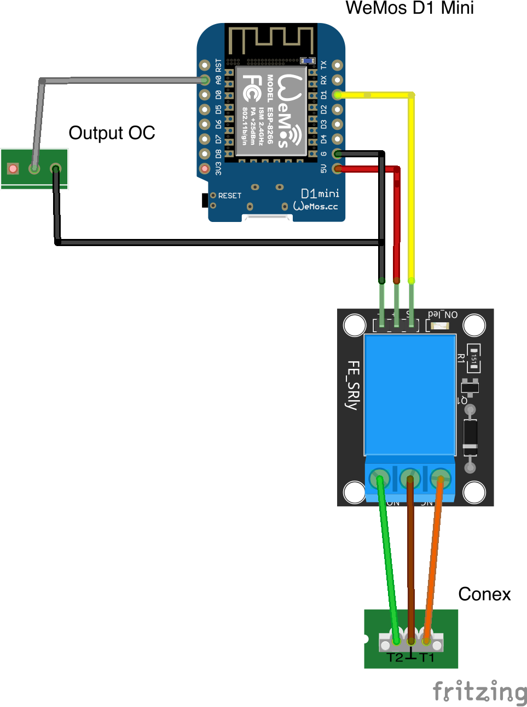

# Home Assistant Sommer Pro+ / Base+ Garage Door Opener

This is my version of the excellent [garage_pi](https://github.com/azrael783/garage_pi) project by [Daniel](https://github.com/azrael783/) that uses a WeMos D1 mini instead of a Raspberry Pi Zero.

Enjoying this? Help me out with a :beers: or :coffee:!

## Prerequisites ##

**Software**
* [Arduino IDE](https://www.arduino.cc/en/main/software) - I'm using v1.8.12
* Arduino JSON - v6.15.1
* PubSubClient - v2.7.0
* ESP8266WiFi
* ArduinoOTA

**Hardware**

* [Sommer Pro+ / Base+](https://www.sommer.eu/en-GB/pro-base.html)
* [Sommer Conex Adapter](https://www.sommer-shops.eu/de/conex.html)
* [Sommer Output OC Adapter](https://www.amazon.co.uk/gp/product/B07XZKDFX9/ref=ppx_yo_dt_b_asin_title_o05_s00?ie=UTF8&psc=1)
* [Wemos D1 Mini](https://docs.wemos.cc/en/latest/d1/d1_mini.html)
* [1 Channel Relay Shield](https://www.amazon.co.uk/gp/product/B07DK1FZF9/ref=ppx_yo_dt_b_asin_title_o03_s00?ie=UTF8&psc=1)
* [A 24V to 12v USB Power Adaptor](https://www.amazon.co.uk/gp/product/B07NMPDDN7/ref=ppx_yo_dt_b_asin_title_o02_s00?ie=UTF8&psc=1)
* [Wemos D1 Mini Relay Case](https://www.thingiverse.com/thing:2667568)

## Setup ##

**Flashing project to the WeMos**

Once you have setup your software, you first need to download this project, by clicking `clone -> Download ZIP`.

Unzip the file and navigate to the contents. you should see a file named `My_Helper_sample.h`, go ahead and rename it to `My_Helper.h`.

Now open `garage_door_sensor.ino`. Doing so should open it in the [Arduino IDE](https://www.arduino.cc/en/main/software).

You do not need to make any changes to the `garage_door_sensor` script itself!

Click on the `My_Helper.h` tab, that is where you will add your WiFi credentials for your home network & your MQTT details.

**Wiring**

You will need to solder a wire to `G` and `A0` on the bottom of the D1 Mini. Plug these into the `GND` and `OUT` pins on the Output OC PCB respectively.

Connect the relay to the Sommer Conex PCB. The `NO` terminal should connect to `T1` on the Conex, `NC` to `T2`, with `COM` terminal connecting to the centre pin.

Finally the USB power Adapter needs to be plugged into the `24v` and `Ground` of the Sommer circuit board.

## Upload ##

The next step, once you're happy with the details is to upload the project to the Wemos D1 Mini.

To do that you select `Tools` from the top menu within the IDE.

Then you need to set the upload parameters to the following;

The next step is to simply plug your device in the computer, Go to `Tools -> Port` and select it.

For me this usually says something `dev/usbserial...`

You will only need the device plugged in on your first upload, after that you should see your devices name and it's IP address in the port list.

Now you just click on the upload button in the top left corner of the IDE, it's the right-facing arrow.

After a bit of time compiling, the script should be uploaded to the device and begin scanning for the car.

You can see what the device is doing by going to `Tools -> Serial Monitor`

If the upload doesn't work the most likely cause is that you forgot to rename the `My_Helper_sample.h` file or import the above libraries.

## Integrating with Home Assistant ##

The simplest way to integrate with [Home Assistant](https://home-assistant.io) is to turn on [MQTT discovery](https://www.home-assistant.io/docs/mqtt/discovery/). With this activated the device will be added automatically.

Alternatively you can add a new `cover` to the `configuration.yaml` like this:

    cover:
    - platform: mqtt
      name: Garage Door
      command_topic: "homeassistant/cover/garage/set"
      state_topic: "homeassistant/cover/garage/state"
      state_open: "open"
      state_opening: "opening"
      state_closed: "closed"
      state_closing: "closing"
      payload_open: "OPEN"
      payload_close: "CLOSE"
      qos: 1
      optimistic: true
      device_class: garage

## Finshed Product ##

Here is what the final project looks like for me now:

## Changelog ##

### Version 1.3 - Bug fixes ###

Added an additional check for the door status to prevent incorrect status being sent.

State is now checked twice with a gap of 0.5 seconds. MQTT publish is only done when both values agree on a state and that state is different from the previous one.

### Version 1.2 - Added LED status indicator and WiFi auto reconnect. ###

* Solid light = No WiFi connection
* Flashing Light = no MQTT connection
* No light = connection established

WiFi will now attempt to reconnect to network if it loose it post setup.

### Version 1.1 - Better integration with Home Assistant. ###

Added Device Registry info fo better integration with Home Assistants UI.

Make, Model, Version etc.

Should appear as a device with one entity upon initial connection.

### Version 1.0 - Better integration with Home Assistant, Over The Air updates ###

Moved to a 1 Channel Relay model.

Added analog input for Output OC to receive live door status.

ArduinoOTA for wireless code updates.

Added MQTT config on boot to integrate seamlessly with Home Assistant.

Added availability topic so we can report an offline/unavailable status to Home Assistant.
